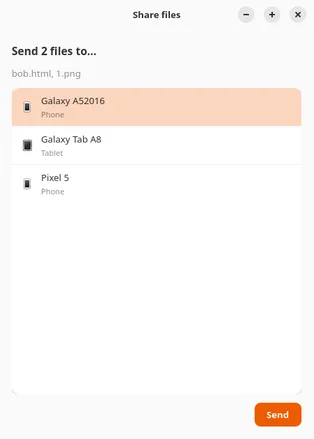

# kdeconnect-share-files

Send files to a device paired in KDE Connect — your phone, most of the time —
from a small window: pick the files, pick the device in the list, done.

## Screenshot



## Install

KDE Connect and the GTK4 libraries must be on your computer first. On
Debian / Ubuntu, one command:

```sh
# install KDE Connect, pipx and the GTK4 libraries the app needs
sudo apt install pipx python3-gi gir1.2-gtk-4.0 gir1.2-adw-1
```

Then install the app itself, from the `.whl` file attached to the release:

```sh
# install the app; --system-site-packages reuses the libraries installed above
# instead of trying to rebuild them
pipx install --system-site-packages dist/kdeconnect_share_files-1.0.0-py3-none-any.whl
```

pipx keeps the app in its own hidden directory and puts the
`kdeconnect-share-files` command in `~/.local/bin`.
To remove it later: `pipx uninstall kdeconnect-share-files`.

Needs GTK 4.10+ and libadwaita 1.6+. Tested with KDE Connect 25.12, GTK 4.22 and
Python 3.12.

## Use it

```sh
kdeconnect-share-files report.pdf             # one file
kdeconnect-share-files report.pdf photo.jpg   # several files
kdeconnect-share-files https://example.com    # a URL also works
```

Then pick the device in the list and press *Send*. With no argument at all, the
window opens a file chooser, and files can be dropped on the window at any time.

The window closes as soon as KDE Connect takes charge of the transfer; KDE
Connect then shows the progress and the result in its own window. Nothing else to
configure: the app talks to the KDE Connect daemon already running on your
session.

## For contributors

Run the app from the sources, in a private Python that reuses the libraries of
your system:

```sh
python3 -m venv --system-site-packages .venv     # create the private Python
.venv/bin/pip install --no-build-isolation -e .  # install this directory
.venv/bin/kdeconnect-share-files report.pdf      # run it
```

Build the wheel that is distributed:

```sh
python -m pip wheel --no-build-isolation --no-deps -w dist .
```

## Limitations

KDE Connect never says whether a transfer succeeded, so this window cannot tell
you either: it closes as soon as the request is accepted. And a device that just
went offline can still appear in the list — the app checks with KDE Connect
before sending, but cannot know more than KDE Connect itself does.
